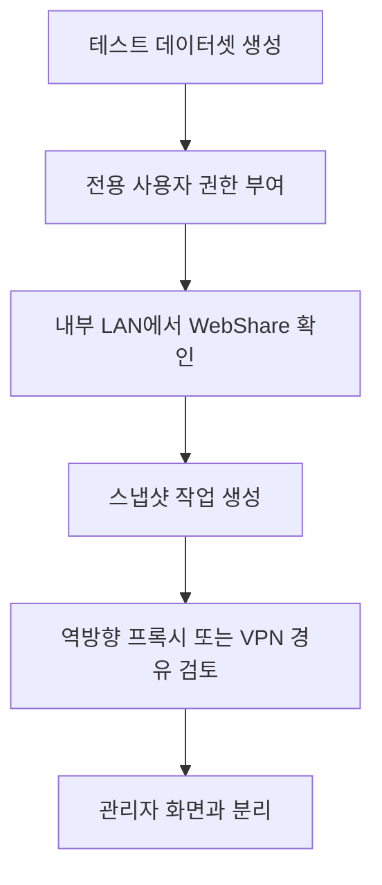

이 그림에서는 파일 서버가 인터넷으로 바로 열리는 순간 권한 실수가 데이터 유출로 이어질 수 있다는 점을 봐야 한다.

TrueNAS 26 WebShare는 Dropbox처럼 브라우저에서 파일을 주고받는 기능이라 홈서버 사용자에게 끌린다. 다만 2026년 7월 4일 기준 확인한 최신 공개판은 TrueNAS 26-BETA.2이고, 공식 공지도 Early Release는 중요한 작업에 쓰지 말라고 안내한다. 운영 NAS에 바로 올리기보다 Proxmox 테스트 VM이나 남는 SSD 한 장으로 권한 흐름만 따로 확인하는 쪽이 맞다.

내가 처음 헷갈렸던 건 WebShare가 단순한 SMB 대체 기능처럼 보였다는 점이다. 공식 TrueNAS 26 소개에 따르면 WebShare와 TrueSearch는 TrueNAS Connect 계정 연결을 통해 제공되고, 브라우저·태블릿·휴대폰에서 파일 공유를 목표로 한다. 즉 내부 SMB 공유 하나 더 만드는 문제가 아니라, 계정·검색 인덱스·외부 접근 경계까지 같이 봐야 한다.

## 테스트 환경

| 항목 | 값 |
|---|---|
| 확인 날짜 | 2026-07-04 |
| 버전 | TrueNAS 26.0.0-BETA.2 |
| 권장 위치 | 운영 NAS가 아닌 Proxmox 테스트 VM |
| 테스트 데이터셋 | `tank-test/webshare-demo` |
| 외부 공개 | 처음엔 금지, 내부 LAN에서만 확인 |

## 데이터셋부터 분리한다

기존 가족 사진, 문서, 백업 폴더를 바로 물리면 안 된다. 테스트용 데이터셋을 따로 만들고 샘플 파일 3~5개만 넣는다. 여기서 중요한 건 ACL(접근 제어 목록)이다. SMB에서 잘 보이던 폴더라도 WebShare에서 같은 의미로 보인다고 가정하면 삽질한다.

TrueNAS Shell에서 테스트 파일을 만든다.

```bash
mkdir -p /mnt/tank-test/webshare-demo
echo "webshare test" > /mnt/tank-test/webshare-demo/readme.txt
```

그다음 웹 UI에서 `Datasets -> webshare-demo -> Edit Permissions`로 들어가 전용 사용자만 읽고 쓰게 둔다. 관리자 계정으로 테스트하면 권한 오류를 못 잡는다. 나는 여기서 관리자 계정으로 열어 보고 괜찮다고 착각했다가 일반 사용자에서 파일 업로드가 막히는 걸 뒤늦게 봤다.

## 공개 전 체크 순서



외부에서 접근해야 한다면 포트포워딩으로 TrueNAS 관리 화면까지 같이 열지 않는다. WebShare만 필요한 상황이면 Tailscale VPN이나 별도 Reverse Proxy(외부 도메인 요청을 내부 서버로 전달하는 중계 서버)를 쓰고, 관리자 UI는 내부망에 남겨둔다. Cloudflare Tunnel을 쓰더라도 `/ui`, 관리 포트, API가 같이 노출되는지 확인해야 한다.

## 스냅샷은 기능 테스트보다 앞에 둔다

브라우저 공유는 링크를 잘못 전달했을 때 삭제·덮어쓰기 사고가 빠르게 난다. `Data Protection -> Periodic Snapshot Tasks`에서 테스트 데이터셋에 1시간 간격, 24시간 보존 스냅샷을 만든 뒤 업로드와 삭제를 시험한다. 운영 데이터셋으로 옮길 때는 보존 기간을 최소 7일 이상으로 잡는 게 낫다.

| 확인 항목 | 통과 기준 |
|---|---|
| 일반 사용자 로그인 | 관리자 권한 없이 접근 가능 |
| 업로드 테스트 | 지정 폴더 밖으로 이동 불가 |
| 삭제 복구 | 스냅샷에서 파일 복원 가능 |
| 외부 접속 | WebShare만 열리고 관리 UI는 차단 |

TrueNAS 26-BETA.2에는 WebShare·TrueSearch 관련 수정도 포함됐고, macOS SMB 목록 성능과 ACL 프리셋 개선도 같이 들어갔다. 그래서 새 기능을 만져볼 가치는 있다. 하지만 지금 기준으로 운영 NAS의 파일 공유 방식을 바꿀 단계는 아니다. 테스트 VM에서 데이터셋, 권한, 스냅샷, 공개 경로까지 확인한 뒤 안정 릴리스에서 다시 판단하는 게 현실적이다.

자료: [TrueNAS 26-BETA.2 공지](https://forums.truenas.com/t/truenas-26-0-0-beta-2-is-now-available/66483), [TrueNAS 26 소개](https://www.truenas.com/blog/blog-truenas-26-beta1-release/)
