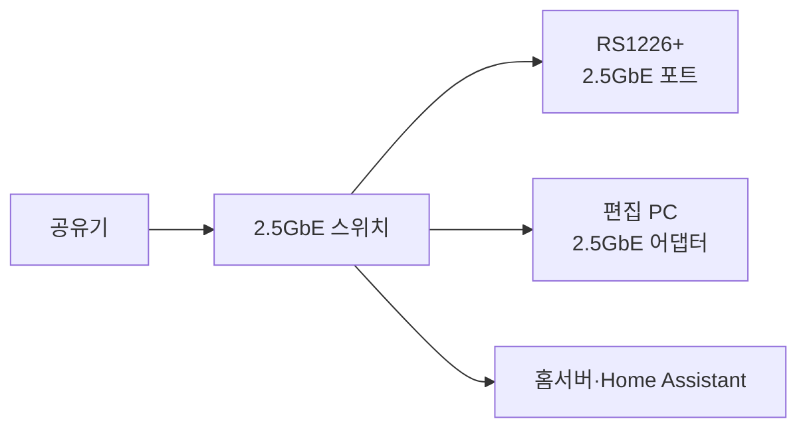

2026년 7월 출시된 Synology RS1226+는 8베이 랙형 NAS로, 기본 2.5GbE 포트와 M.2 NVMe 슬롯을 넣었다. 집에서 쓴다면 디스크보다 **2.5GbE 스위치까지 같이 구성하는 것**이 체감 차이가 크다. NAS만 바꾸고 공유기와 PC를 1GbE로 둔 채 속도가 안 나온다고 삽질하기 쉽다.

## RS1226+ 홈랩 구성 기준

Synology 공식 발표의 순차 읽기 2,300MB/s 이상·쓰기 1,500MB/s 이상은 여러 클라이언트와 호환 디스크를 사용한 제조사 테스트다. 단일 HDD 복사에서 이 숫자를 기대하면 안 된다.

| 장비 | 설정 기준 | 이유 |
|---|---|---|
| NAS | RS1226+, DSM 7.4-90075 이상 | 최신 네트워크·스토리지 기능 적용 |
| 스위치 | 2.5GbE 관리형 또는 비관리형 | NAS와 PC의 링크 속도 통일 |
| PC | 2.5GbE 어댑터 | 병목 구간 제거 |

구성은 아래처럼 시작했다.



## DSM 7.4에서 링크부터 확인

케이블을 연결한 뒤 **제어판 → 네트워크 → 네트워크 인터페이스**에서 `2500 Mbps, Full Duplex`를 확인한다. `1000 Mbps`라면 스위치 포트와 PC 어댑터부터 본다.

IP는 수동 입력보다 공유기에서 NAS MAC 주소에 DHCP 예약을 거는 편이 관리하기 쉽다. NAS에는 `192.168.10.20`, 홈서버에는 `192.168.10.30`을 예약했다.

점보 프레임(MTU 9000)은 바로 켜지 않았다. 세 장비가 모두 지원할 때만 같은 값으로 맞춘다.

```text
NAS: 제어판 → 네트워크 → 네트워크 인터페이스 → MTU 9000
스위치: 해당 포트의 Jumbo Frame 9000
PC: 이더넷 어댑터 속성 → Jumbo Packet 9014 또는 9000
```

## 속도 테스트는 캐시를 의심하며 한다

10GB 파일 하나만 복사하고 속도를 판단하면 안 된다. 20~50GB 파일 여러 개를 복사하고 다른 PC에서도 읽어본다.

| 확인 항목 | 정상 판단 기준 |
|---|---|
| 링크 | NAS·스위치·PC 모두 2.5Gbps |
| 단일 파일 | 초당 200MB 안팎이면 HDD 구성에서 무난 |
| 동시 작업 | PC 2대에서 속도 급락 여부 확인 |

백업은 밤 시간에 예약하고, 관리형 스위치를 쓴다면 홈서버·IoT VLAN을 분리한다.

## 설정 뒤 꼭 확인할 것

- DSM 관리자 포트 `5000/5001`을 인터넷에 직접 공개하지 않는다.
- 2.5GbE 포트가 여러 개라면 링크 집성보다 먼저 실제 병목을 측정한다.
- NVMe 캐시는 백업이 아니며, 캐시 장애를 고려해 원본 데이터의 별도 백업을 둔다.
- DSM 7.4는 설치 후 이전 버전으로 되돌릴 수 없으므로 패키지 호환성과 설정 백업을 먼저 확인한다.

RS1226+의 핵심은 랙형 외관이 아니라 네트워크 구간 전체를 2.5GbE로 맞출 수 있다는 점이다. NAS 한 대만 교체하는 방식보다 스위치와 클라이언트까지 같은 속도로 맞추고, MTU는 마지막에 검증하는 순서가 실패가 적었다.

참고한 공식 문서:

- [Synology RS1226+ 출시 안내](https://www.synology.com/en-au/company/news/article/RS1226rpp)
- [Synology DSM 7.4 릴리스 정보](https://www.synology.com/en-us/releaseNote/DSM?model=DS925%2B)
